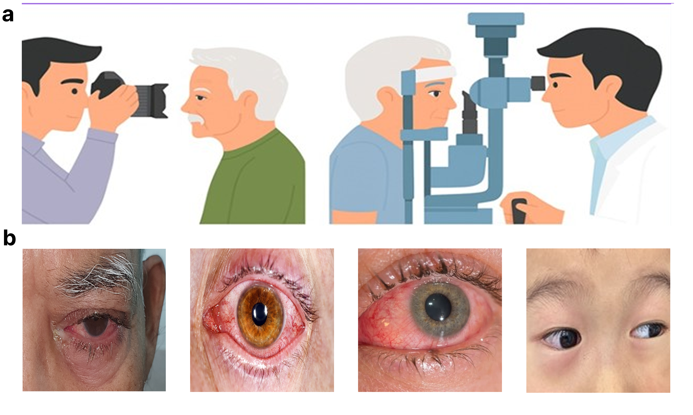
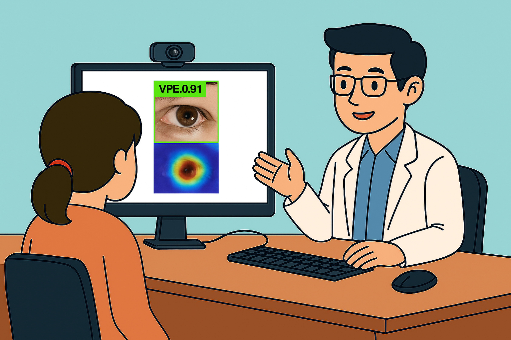

# 👁️ AI-Based Intelligent Healthcare System


An **AI-powered Intelligent Healthcare System** for automated eye disease detection and classification using lightweight deep learning and explainable artificial intelligence.

The proposed framework is designed to support:

* Telemedicine
* Smart Healthcare
* Mobile Healthcare
* Edge AI Applications
* Resource-Constrained Clinical Settings

---

# 🌟 Highlights

✅ Lightweight YOLOv8-based architecture

✅ Real-time eye disease detection

✅ Expert-annotated clinical eye image dataset

✅ Four-class disease classification

✅ Explainable AI using Eigen-CAM

✅ Lightweight and computationally efficient

✅ Suitable for mobile and edge deployment

✅ Designed for resource-limited healthcare environments

---

# 🏥 Applications

* Automated Eye Disease Screening
* Telemedicine Platforms
* Rural Healthcare Centers
* Mobile Diagnostic Applications
* Smart Hospitals
* Clinical Decision Support Systems

---

# 📂 Repository Structure

```text
AI-Based-Intelligent-Healthcare-System/

├── .gitignore

├── AI-Based Intelligent Healthcare System for Real-Time Eye Disease Detection.mp4

├── AI_Based_Intelligent_Healthcare_System.ipynb

├── LICENSE

├── README.md

├── healthcare_dataset_collection.png

└── real_time_eye_disease_detection.png
```

---

# 📊 Dataset

The custom-curated clinical dataset contains:

| Property     |                   Value |
| ------------ | ----------------------: |
| Total Images |                   3,469 |
| Resolution   |               640 × 640 |
| Annotation   | Expert Ophthalmologists |
| Image Type   |     Clinical Eye Images |
| Classes      |                       4 |

### Disease Classes

| Class | Description        |
| ----- | ------------------ |
| BPE   | Bacterial Pink Eye |
| APE   | Allergic Pink Eye  |
| VPE   | Viral Pink Eye     |
| NE    | Normal Eye         |

---

# 🤖 Model

The proposed framework employs a lightweight **YOLOv8** architecture due to its excellent balance between:

* Accuracy
* Computational Efficiency
* Lightweight Design
* Real-Time Performance

### Performance Features

* High Detection Accuracy
* Lightweight Architecture
* Real-Time Inference
* Edge Device Compatibility
* Explainable Predictions
* Robust Clinical Performance

---

# 🔍 Explainable Artificial Intelligence

To improve transparency and clinical trust, the system integrates:

* Eigen-CAM
* Saliency Visualization
* Heatmap Analysis

These techniques identify important image regions responsible for model predictions and support clinically interpretable diagnosis.

---

# 🖼 Healthcare Dataset Collection



Clinical image acquisition and representative eye images used for model development.

---

# 🖼 Real-Time Eye Disease Detection



Real-time AI prediction and disease localization using explainable artificial intelligence.

---

# 🎥 System Demonstration

**Video:**

`AI-Based Intelligent Healthcare System for Real-Time Eye Disease Detection.mp4`

The video demonstrates:

* Clinical image acquisition
* Dataset preparation
* Real-time disease prediction
* Explainable AI visualization
* Automated healthcare workflow

---

# 🚀 Installation

Clone the repository:

```bash
git clone https://github.com/yourusername/AI-Based-Intelligent-Healthcare-System.git

cd AI-Based-Intelligent-Healthcare-System
```

Install dependencies:

```bash
pip install -r requirements.txt
```

---

# ▶ Usage

Open the notebook:

```bash
AI_Based_Intelligent_Healthcare_System.ipynb
```

Run all notebook cells sequentially to:

* Load the dataset
* Preprocess images
* Train the model
* Evaluate performance
* Visualize explainability results
* Perform real-time prediction

---

# 📄 Research Status

This repository contains the implementation and experimental results of an **AI-Based Intelligent Healthcare System** for automated eye disease detection and classification.

The associated research manuscript is currently **under peer review** in an international journal.

This repository is maintained to promote:

* Open and Reproducible Research
* AI-Driven Healthcare Innovation
* Explainable Artificial Intelligence (XAI)
* Real-Time Clinical Decision Support
* Collaboration Among Researchers and Healthcare Professionals

---

# 👨‍🔬 Authors

### Saima Kanwal †

Engineering Research Centre of Optical Instrument and Systems

University of Shanghai for Science and Technology, Shanghai, China

---

### Muhammad Abdullah †

Faculty of Computing

The Islamia University of Bahawalpur, Pakistan

---

### Sahil Kumar

Department of Computer Science

SZABIST University Larkana Campus, Pakistan

---

### Santosh Kumar

Bolan Medical Complex Hospital

Quetta, Pakistan

---

### Salamat Ali

Faculty of Engineering

The Islamia University of Bahawalpur, Pakistan

---

### Adeel Asgher

Faculty of Computing

The Islamia University of Bahawalpur, Pakistan

---

### Muhammad Shahroz

Faculty of Engineering

The Islamia University of Bahawalpur, Pakistan

---

### Dawei Zhang

Engineering Research Centre of Optical Instrument and Systems

University of Shanghai for Science and Technology, Shanghai, China

---

### Dileep Kumar *

Faculty of Engineering

The Islamia University of Bahawalpur, Pakistan

---

***** Corresponding Author

**†** Equal Contribution

---

# ⭐ Support

If you find this repository useful:

⭐ Star this repository

🍴 Fork this repository

🤝 Contribute to the project

📢 Share with the research community

Together, we can advance **AI-driven Intelligent Healthcare** for accessible, transparent, and reliable medical diagnosis.
